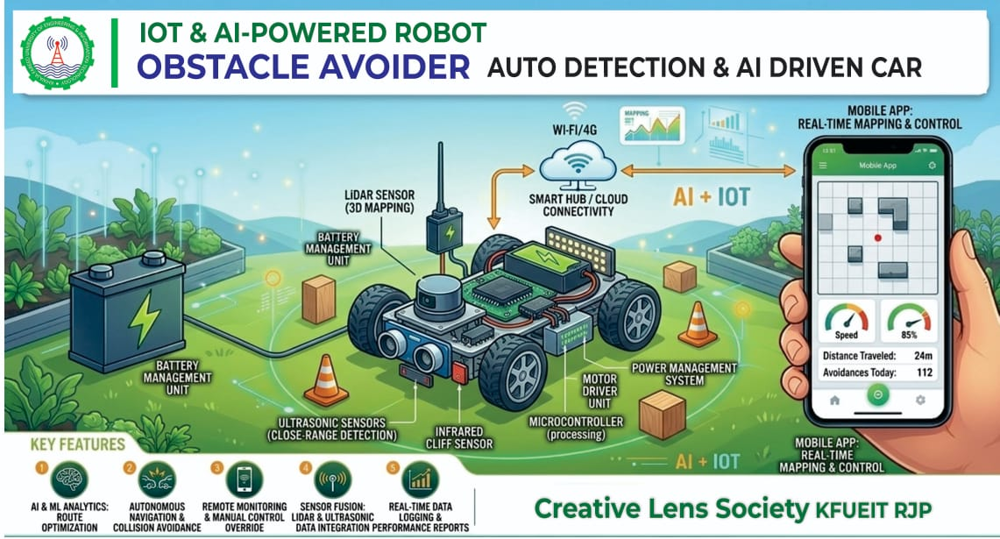

# IoT & AI-Powered Autonomous Robot Car

## Project Overview
An IoT and AI-powered autonomous robot car designed to navigate environments safely and intelligently without continuous human control.

## Key Features
- Autonomous obstacle avoidance
- Ultrasonic sensors for close-range obstacle detection
- Infrared sensors for cliff and edge detection
- LiDAR sensor for 3D mapping
- AI and IoT-based navigation
- Real-time monitoring and control
- Microcontroller-based processing
- Battery and power management

## Technologies
- IoT
- Artificial Intelligence
- LiDAR
- Ultrasonic Sensors
- Infrared Sensors
- Microcontroller

## Project Image

## Project Purpose
The main purpose of this project is to develop a smart autonomous robot car that can detect obstacles, avoid collisions, navigate safely, and support real-time monitoring and control.

## Developed By
Creative Lens Society — KFUEIT RJP
